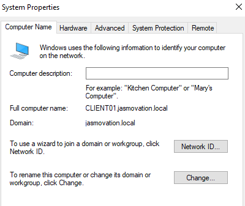

# 🧠 Windows Server 2022 Active Directory Lab (VirtualBox)

### 📁 Project Overview
This project demonstrates a fully functional on-premises Active Directory domain built in Oracle VirtualBox, featuring a Windows Server 2022 Domain Controller (DC01) and a Windows 10 Pro client (CLIENT01) joined to the domain **jasmovation.local**.

The lab replicates core enterprise networking and user-management components, including DHCP, DNS, and Group Policy.  
It also verifies domain authentication and shared-folder permissions using a real domain user account.

---

## ⚙️ Environment Architecture

| Component | Role | OS | IP Address | Notes |
|------------|------|----|-------------|-------|
| **DC01** | Domain Controller / DNS / DHCP | Windows Server 2022 Standard | 192.168.10.10 | Hosts the domain `jasmovation.local` |
| **CLIENT01** | Domain Workstation | Windows 10 Pro 22H2 | 192.168.10.11 | Joined to `jasmovation.local` |
| **LABNET** | Internal VirtualBox Network | — | 192.168.10.0/24 | Isolated internal LAN |

---

## 🧩 Configuration Highlights
- **Active Directory Domain Services (AD DS)** promoted on DC01  
- **DHCP Scope:** 192.168.10.20 – 192.168.10.200  
- **DNS:** Forward Lookup Zone `jasmovation.local` with dynamic updates  
- **Domain Join:** CLIENT01 → jasmovation.local  
- **Domain User:** `JASMOVATION\LabUser` (`Secure@2024`)  
- **Shared Folder:** `\\dc01\CompanyShare` (granted Domain Users Modify access)  
- **Group Policy Test:** custom logon-message policy pushed to CLIENT01  

---

## 🧱 Skills Demonstrated
- Windows Server deployment & role configuration  
- Active Directory user, computer & policy management  
- DHCP/DNS installation & troubleshooting  
- Domain join and user authentication  
- NTFS and network share security permissions  
- VirtualBox network design (NAT vs Internal Network)  
- Snapshot management and environment backup  

---

## 🧰 Tools & Resources
- Oracle VirtualBox 7.x  
- Windows Server 2022 ISO  
- Windows 10 22H2 ISO  
- PowerShell / CMD  
- Server Manager + DHCP / DNS / ADUC MMC tools  

---

## 🖼️ Screenshots

#### Screenshot 1 — Server Roles Installed
Server Manager showing AD DS, DNS, DHCP, and File Services roles installed.  

#### Screenshot 2 — DHCP Scope Configured
DHCP Scope 192.168.10.0/24 active with Router/DNS/Domain options set.  

#### Screenshot 3 — CLIENT01 Domain Join
CLIENT01 successfully joined to `jasmovation.local` domain.  

#### Screenshot 4 — Domain User Created
LabUser account created in Active Directory Users and Computers.  

#### Screenshot 5 — Domain User Access Verified
The `LabUser` account successfully authenticated from CLIENT01 and accessed the shared folder `\\dc01\CompanyShare`, confirming end-to-end AD DS, DNS, DHCP, and NTFS integration.  

---

## 🧩 Future Enhancements
- Add a Windows 11 client  
- Implement WSUS or a dedicated file server (FILE01)  
- Configure Group Policy for security baselines  
- Automate domain setup with PowerShell scripts  

---

## 📜 Credits
**Created by Jasmine Lopez (Jasmovation)**  
Documentation and network build authored during 2025 VirtualBox AD Lab series.

---
